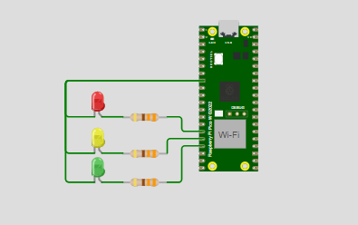
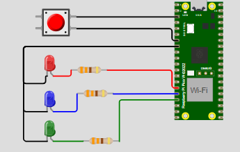

<h1 align="center"><br>Clock e Temporizadores BitDogLab</h1>

<h3 align="center">
   Clocks e Temporizadores na placa BitDogLab em Linguagem C
</h3>

---

Tabela de conteúdos
=================
<!--ts-->
   * [Sobre o projeto](#-sobre-o-projeto)
   * [Layout Repositorio Github](#-layout-repositorio-github)
   * [Funcionalidades](#-Funcionalidades)
   * [Como executar o projeto](#-como-executar-o-projeto)
   * [Imagens do Projeto](#-imagens-do-projeto)
     * [Imagem](#-projeto-na-extensão-wokwi-simulator-no-visual-studio)
   * [Tecnologias](#-tecnologias)
     * [Websites](#-websites)
     * [Utilitários](#user-content-server--nodejs----typescript)
   * [Contribuidores](#-contribuidores)
   * [Licença](#-licença)
<!--te-->

---

## 💻 Sobre o projeto

### Atividade 1: 

Este projeto implementa um sistema de controle de semáforo utilizando a placa BitDogLab (Raspberry Pi Pico W) com o uso de temporizadores. O sistema simula a mudança de cores do semáforo (vermelho, amarelo e verde) a cada 3 segundos, indicando o estado atual através do monitor serial.

Componentes Utilizados:

- LED Vermelho (GPIO 13) - Indica "PARE!".

- LED Amarelo (GPIO 12) - Indica "ATENÇÃO!".

- LED Verde (GPIO 11) - Indica "SIGA!".

O código utiliza um temporizador repetitivo para alternar as cores e exibir mensagens no console.

### Atividade 2: 

Este projeto implementa um sistema de controle de LEDs utilizando a placa BitDogLab (Raspberry Pi Pico W) com o uso de interrupções e temporizadores. Através do pressionamento de um botão, três LEDs (azul, vermelho e verde) são acesos simultaneamente e desligados em sequência, com intervalos de 3 segundos entre cada um. O status dos LEDs é exibido no monitor serial durante a execução do programa.

Componentes Utilizados:

- Botão (GPIO 5) - Dispara a sequência de iluminação dos LEDs.

- LED Azul (GPIO 13) - Primeiro a ser desligado.

- LED Vermelho (GPIO 12) - Segundo a ser desligado.

- LED Verde (GPIO 11) - Último a ser desligado.
---

## 🎨 Layout Repositorio Github
<i>
EmbarcaTech_U4_Clock-Temporizadores

-Atvd1_Temporizador_Periodico

   - assets/&emsp;&emsp;&emsp;&emsp;# Midias do Projeto
       - diagrama.png
       - Video_Demonstration

   - CMakeLists.txt
   
   - diagram.json&emsp;&emsp;&emsp;&emsp;# Arquivo Wokwi do BitDogLab
   
   - main.c&emsp;&emsp;&emsp;&emsp; # Código principal do projeto
   
   - pico_sdk_import.cmake
   
   - wokwi.toml

-Atvd2_OneShot

   - assets/&emsp;&emsp;&emsp;&emsp;# Midias do Projeto
       - diagrama.png
       - Video_Demonstration

   - CMakeLists.txt
   
   - diagram.json&emsp;&emsp;&emsp;&emsp;# Arquivo Wokwi do BitDogLab
   
   - main.c&emsp;&emsp;&emsp;&emsp; # Código principal do projeto
   
   - pico_sdk_import.cmake
   
   - wokwi.toml


</i>

---

## ⚙️ Funcionalidades

### Atividade 1:
- Alternância entre os estados "PARE", "ATENÇÃO" e "SIGA".
- Mensagens no monitor serial indicando o estado atual.
- Ciclo de troca de cor a cada 3 segundos.

### Atividade 2:
- Acionamento dos LEDs através do botão.
- Desligamento automático dos LEDs em sequência com intervalos de 3 segundos.
- Indicação do status dos LEDs via mensagens no monitor serial.

---

## 🚀 Como executar o projeto

💡Siga as instruções abaixo para configurar, compilar e executar o programa.

### Pré-requisitos

Antes de começar, você vai precisar ter instalado em sua máquina as seguintes ferramentas:
  - Sistema operacional Linux, macOS ou Windows (com suporte a Makefile).
  - [Git](https://git-scm.com) (Opcional, mas recomendado),
  - [GCC compilador](https://gcc.gnu.org)
  - [Biblioteca Pico-Sdk](https://github.com/raspberrypi/pico-sdk.git) (OBS: Necessário caso queira modificar o projeto)

Além disto é bom ter um editor para trabalhar com o código como [VSCode](https://code.visualstudio.com/) com a extensão [Raspberry](https://marketplace.visualstudio.com/items?itemName=raspberry-pi.raspberry-pi-pico)  e usar o simulador web [Wokwi](https://wokwi.com) (ou a extensão do Vscode [Wokwi Simulator](https://marketplace.visualstudio.com/items?itemName=Wokwi.wokwi-vscode))

### 🎲 Dowload do Projeto

#### Dowload do Projeto no Desktop
- Opção 1:
  - Abra o terminal de comando Git Bash 
  - Clone o repositório do GitHub com o comando:
```
$ git clone https://github.com/Dyeorn/EmbarcaTech_U4_Clock-Temporizadores
```
- Opção 2:
  - No repósitorio [EmbarcaTech_U4_Clock-Temporizadores](https://github.com/Dyeorn/EmbarcaTech_U4_Clock-Temporizadores) aperte o Botão <i><>code</i>
  - Aperte a opção <i>Dowload ZIP</i>


### 🎲 Rodando a Animação no Wokwi

#### Wokwi Web
- Entre no navegador e digite [Wokwi.com]()
- Faça Upload dos Arquivos <i>diagram.json</i>
- Faça upload do aquivo main <i>main.c</i> e da pasta <i>src/</i>

#### Extensão Wokwi
- Abra o Visual Studio
- Na aba da extensão [Raspberry Pi Pico](https://marketplace.visualstudio.com/items?itemName=raspberry-pi.raspberry-pi-pico), aperte para Importar o projeto
- Compile o projeto
- crie um arquivo (caso não tenha no projeto) <i>wokwi.toml</i> e digite o código:
```
[wokwi]
version = 1
firmware = 'build/main.hex'
elf = 'build/main.elf'
```
- Abra o arquivo <i>diagram.json</i>


### 🎲 Rodando as Animações na placa BitdogLab

#### Placa BitDogLab
- Através de um cabo USB conecte a placa ao seu Disposito
- Aperte o Botão Bootsel e Reset 

#### VsCode Studio
- Abra o Visual Studio
- Na aba da extensão [Raspberry Pi Pico](https://marketplace.visualstudio.com/items?itemName=raspberry-pi.raspberry-pi-pico), aperte para Importar o projeto
- Compile o projeto
- Entre na pasta <i>build/</i>
- Cole o arquivo <i>nmain.uf2</i> no armazenamento placa BitDog
- Ou, apenas compile o projeto e clique em "Run Project (USB)
<br>

---

## 🎥 Imagens do Projeto

### 💿 Diagrama Visual do Projeto

Atividade 1:
<p align="center"></p>

Atividade 2:
<p align="center"></p>


---

## 🛠 Tecnologias

As seguintes ferramentas foram usadas na construção do projeto:

#### **Websites**
-   **[Github](https://github.com)**
-   **[Wokwi Web](https://gcc.gnu.org)**


#### **Utilitários**

-   Editor:  **[Visual Studio Code](https://code.visualstudio.com/)**  → Extensions:  **[C/C++](https://marketplace.visualstudio.com/items?itemName=ms-vscode.cpptools), [C/C++ Compile Run](https://marketplace.visualstudio.com/items?itemName=danielpinto8zz6.c-cpp-compile-run), [Raspberry Pi Pico](https://marketplace.visualstudio.com/items?itemName=raspberry-pi.raspberry-pi-pico) e [Wokwi Simulator](https://marketplace.visualstudio.com/items?itemName=Wokwi.wokwi-vscode)**

### **Versionamento**
-   **[Git](https://git-scm.com)**


---

## 👨‍💻 Contribuidores

- João Pedro Jacó Leite
- Mentor: MANOEL MESSIAS DA SILVA JUNIOR

<table>
  <tr>
    <td align="center"><br/><a href="https://github.com/Dyeorn">João Pedro Jacó<a/><br/><br/><a title="Integrante">🌐</a></td>
  </tr>
</table>
      
---


